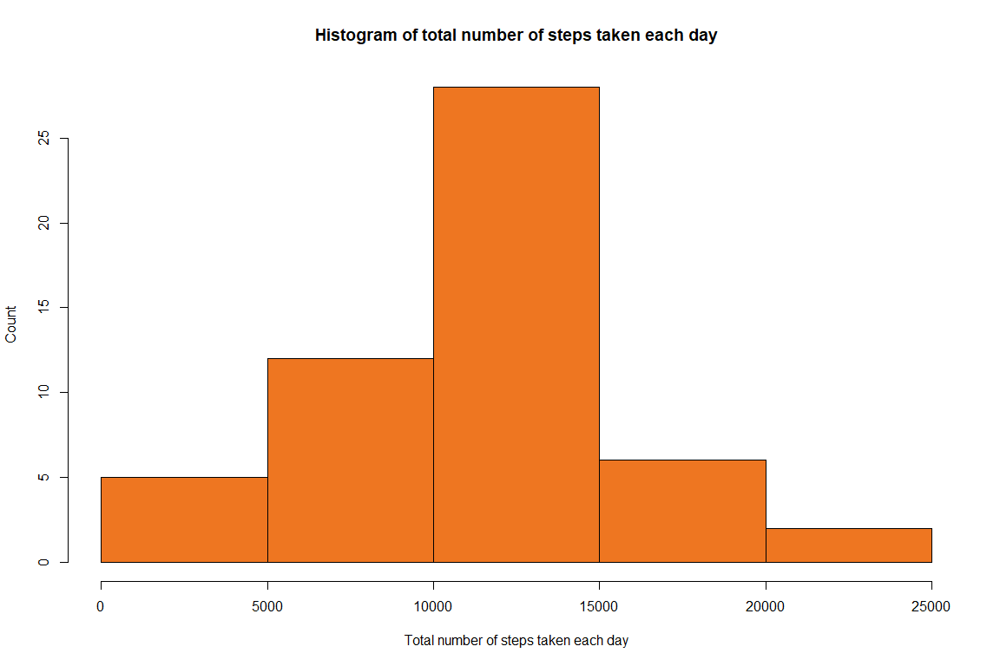
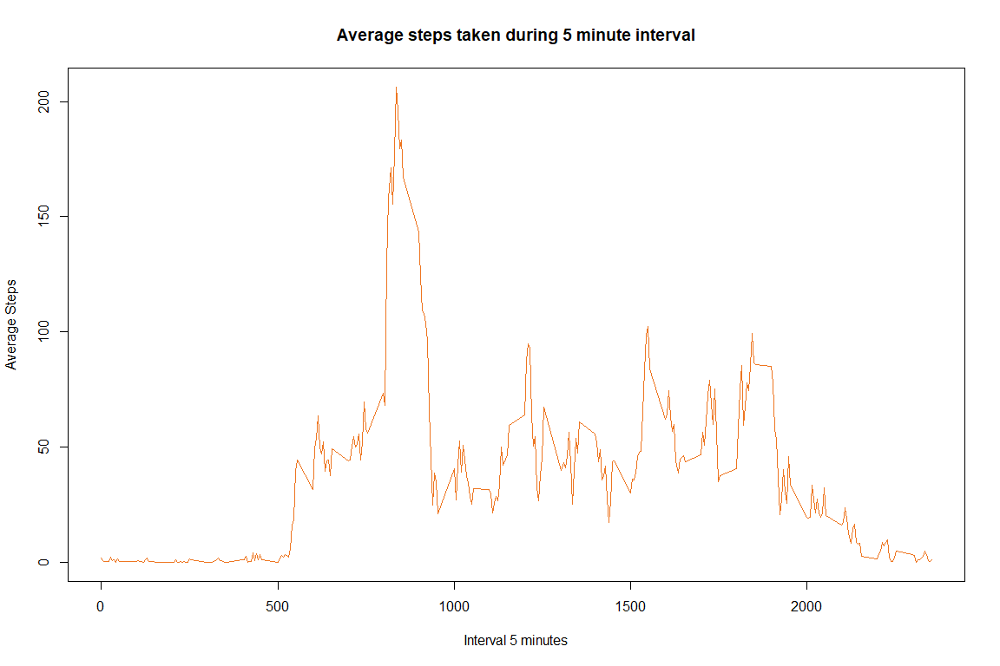
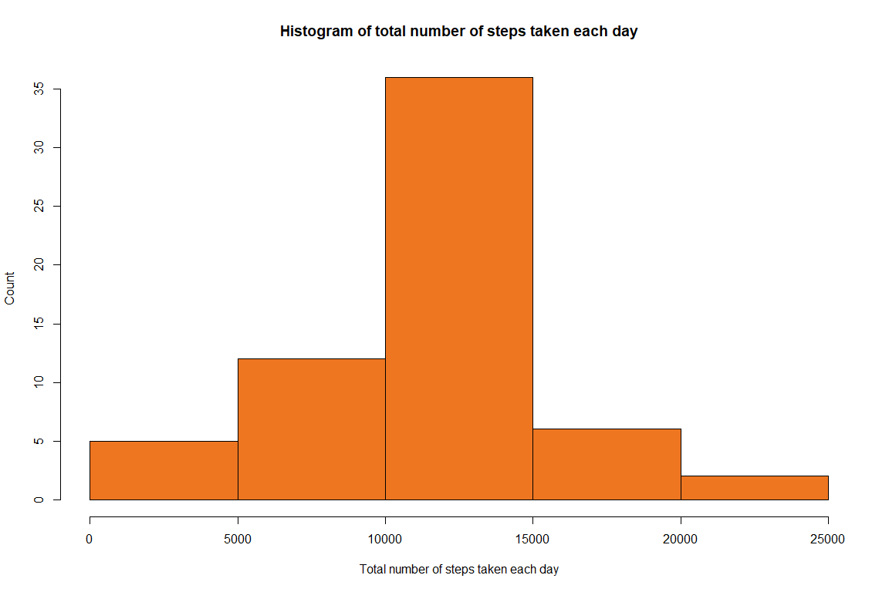
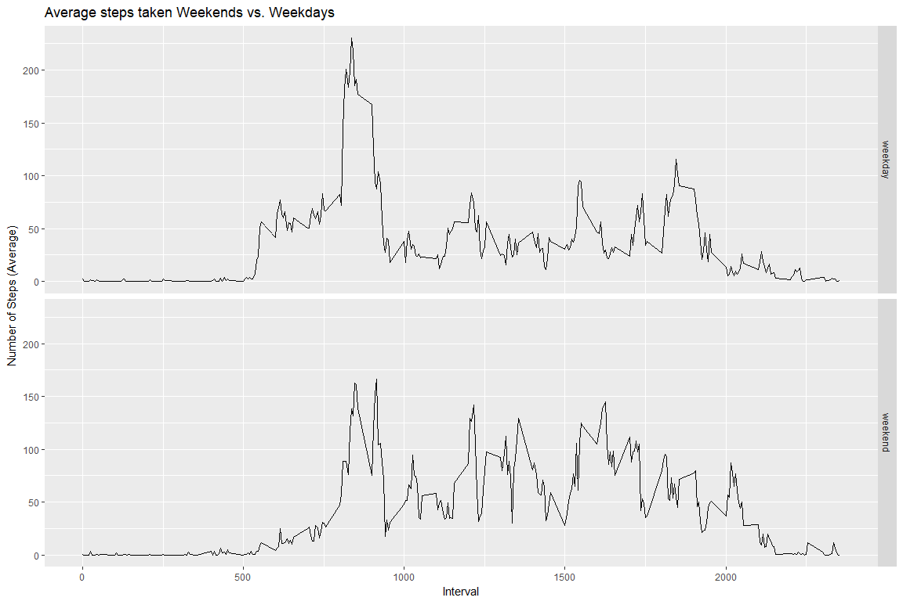

# Reproductible Research  - Course Project 1

This document shows a complete analisys from data activity monitoring devices.

##Introduction
It is now possible to collect a large amount of data about personal movement using activity monitoring devices such as a Fitbit, Nike Fuelband, or Jawbone Up. These type of devices are part of the "quantified self" movement - a group of enthusiasts who take measurements about themselves regularly to improve their health, to find patterns in their behavior, or because they are tech geeks. But these data remain under-utilized both because the raw data are hard to obtain and there is a lack of statistical methods and software for processing and interpreting the data.

This assignment makes use of data from a personal activity monitoring device. This device collects data at 5 minute intervals through out the day. The data consists of two months of data from an anonymous individual collected during the months of October and November, 2012 and include the number of steps taken in 5 minute intervals each day.

The data for this assignment can be downloaded from the course web site:

    Dataset: Activity monitoring data [52K]

The variables included in this dataset are:

    steps: Number of steps taking in a 5-minute interval (missing values are coded as NA)
    date: The date on which the measurement was taken in YYYY-MM-DD format
    interval: Identifier for the 5-minute interval in which measurement was taken

The dataset is stored in a comma-separated-value (CSV) file and there are a total of 17,568 observations in this dataset.

##Loading and preprocessing the data
Show any code that is needed to

    1.Load the data (i.e. read.csv())
    2.Process/transform the data (if necessary) into a format suitable for your analysis


```r
        library(dplyr)
```

```
## 
## Attaching package: 'dplyr'
```

```
## The following objects are masked from 'package:stats':
## 
##     filter, lag
```

```
## The following objects are masked from 'package:base':
## 
##     intersect, setdiff, setequal, union
```

```r
        library(ggplot2)

        activity.dataset <- read.csv("../data/activity.csv",header = TRUE,sep=",")
        activity_clean.dataset <- na.omit(activity.dataset)
        activity_clean.dataset$date <- as.Date(activity_clean.dataset$date)
```

##What is mean total number of steps taken per day?

For this part of the assignment, you can ignore the missing values in the dataset.

    1.Calculate the total number of steps taken per day
    2.If you do not understand the difference between a histogram and a barplot, research the difference betweenthem.Make a histogram of the total number of steps taken each day
    3.Calculate and report the mean and median of the total number of steps taken per day


```r
       # Grouping data and calculate total steps by date.
        totalsteps_perday <- activity_clean.dataset %>% 
                group_by(date) %>% 
                        summarize(TotalSteps=sum(steps)) 
```


```r
         hist(totalsteps_perday$TotalSteps,xlab="Total number of steps taken each day",ylab="Count",main="Histogram of total number of steps taken each day",col="chocolate2")
```

<!-- -->

```r
        mean_report <- format(mean(totalsteps_perday$TotalSteps), digits=2, nsmall=2)
        median_report<- median(totalsteps_perday$TotalSteps)
```

The mean of total steps taken by day is **10766.19** and the median is **10765**

##What is the average daily activity pattern?

    1.Make a time series plot (i.e. type = "l") of the 5-minute interval (x-axis) and the average number of steps taken, averaged across all days (y-axis)
    2.Which 5-minute interval, on average across all the days in the dataset, contains the maximum number of steps?
    

```r
meansteps_perinterval <- activity_clean.dataset %>% 
                group_by(interval) %>% 
                        summarize(averageSteps=mean(steps))     
```


```r
plot(meansteps_perinterval$interval, meansteps_perinterval$averageSteps, type="l", xlab="Interval 5 minutes",
   ylab="Average Steps",main="Average steps taken during 5 minute interval",col="chocolate2")
```

<!-- -->

```r
maxstepinterval <- meansteps_perinterval$interval[which.max(meansteps_perinterval$averageSteps)]
```

The interval where average is on its max value is **835**

##Imputing missing values

Note that there are a number of days/intervals where there are missing values (coded as NA). The presence of missing days may introduce bias into some calculations or summaries of the data.

    1.Calculate and report the total number of missing values in the dataset (i.e. the total number of rows with NAs)
    2.Devise a strategy for filling in all of the missing values in the dataset. The strategy does not need to be sophisticated. For example, you could use the mean/median for that day, or the mean for that 5-minute interval, etc.
    3.Create a new dataset that is equal to the original dataset but with the missing data filled in.
    4.Make a histogram of the total number of steps taken each day and Calculate and report the mean and median total number of steps taken per day. Do these values differ from the estimates from the first part of the assignment? What is the impact of imputing missing data on the estimates of the total daily number of steps?
    


```r
missingvalues <- sum(is.na(activity.dataset$steps))

missingvalues_filled <- activity.dataset

for (i in 1:nrow(activity.dataset)) {
    if (is.na(activity.dataset$steps[i])) {
        
        # Find the index value for when the interval matches the average
        
        indexes <- which(activity.dataset$interval[i] == meansteps_perinterval$interval)
       
        # Assign the value to replace the NA
        missingvalues_filled$steps[i] <- meansteps_perinterval[indexes,]$averageSteps
    }
}

        # Check id date variable stills being date.
        missingvalues_filled$date <- as.Date(missingvalues_filled$date)
```
 
The total number of missing values on activity dataset is **2304**


```r
        # Group data by date, and summarize the sum of steps

        filleddata_stepsperday <- missingvalues_filled %>% 
            group_by(date) %>% 
            summarize(TotalSteps=sum(steps))

        # Show histogram of steps per day with filled data
        hist(filleddata_stepsperday$TotalSteps, 
             xlab="Total number of steps taken each day", 
             ylab="Count", 
             main="Histogram of total number of steps taken each day",
             col="chocolate2")
```

<!-- -->

```r
        filledmean_report <-  format(mean(filleddata_stepsperday$TotalSteps), digits=2, nsmall=2)
        filledmedian_report <- format(median(filleddata_stepsperday$TotalSteps),digits=2,nsmall=2)
```

The mean of total steps taken by day for filled data without NAs is **10766.19** and the median for same data is **10766.19**


The impact for imputing missing values is that mean is still the same but also median is closer to mean and change its value slightly.

##Are there differences in activity patterns between weekdays and weekends?

For this part the weekdays() function may be of some help here. Use the dataset with the filled-in missing values for this part.

    1.Create a new factor variable in the dataset with two levels - "weekday" and "weekend" indicating whether a given date is a weekday or weekend day.
    2.Make a panel plot containing a time series plot (i.e. type = "l") of the 5-minute interval (x-axis) and the average number of steps taken, averaged across all weekday days or weekend days (y-axis). See the README file in the GitHub repository to see an example of what this plot should look like using simulated data.


```r
#Calculate weekday for date.
missingvalues_filled$weekday <- strftime(missingvalues_filled$date,'%a')

#Create two data with each type of days.

weekdays_data <- missingvalues_filled[missingvalues_filled$weekday %in% c("lu.","ma.","mi.","ju.","vi."),]
weekdays_data$daytype <- "weekday"

weekenddays_data <- missingvalues_filled[missingvalues_filled$weekday %in% c("sá.","do."),]
weekenddays_data$daytype <- "weekend"


#Mix all data from two different daytypes
daytypes_data <- bind_rows(weekdays_data,weekenddays_data)
```

##Calculate the average weekday steps versus average weekend steps


```r
dayaverage <- daytypes_data %>%
    group_by(daytype, interval) %>%
    summarize(AverageSteps=mean(steps))
```

##Make a plot of weekdays vs weekends using ggplot2


```r
qplot(interval, AverageSteps, data=dayaverage,
      geom="line",
      xlab="Interval",
      ylab="Number of Steps (Average)",
      main="Average steps taken Weekends vs. Weekdays",
      facets =daytype ~ .)
```

<!-- -->


